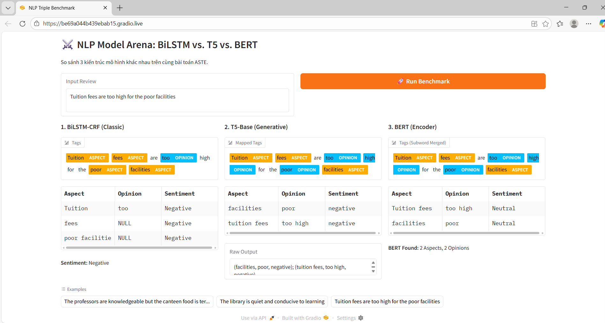

<p align="center">
  <a href="https://www.uit.edu.vn/" title="Trường Đại học Công nghệ Thông tin" style="border: none;">
     
  </a>
</p>

<h1 align="center"><b>EduRABSA: Aspect Sentiment Triplet Extraction (ASTE)</b></h1>

<div align="center">

[](https://www.python.org/)
[](https://pytorch.org/)
[](#)
[](https://gradio.app/)
[](LICENSE)

*Hệ thống trích xuất bộ ba cảm xúc khía cạnh (ASTE) trên tập dữ liệu đánh giá giáo dục EduRABSA, ứng dụng các mô hình Deep Learning, Transformer hiện đại và kỹ thuật FPT-OBS.*

</div>

---

## 👥 Đội ngũ phát triển

* **Môn học:** Xử lý ngôn ngữ tự nhiên 
* **Mã lớp:** CS221.P11
* **Giảng viên hướng dẫn:** TS. Nguyễn Trọng Chỉnh

| MSSV | Họ và tên | Vai trò & Đóng góp | GitHub | Email |
|:---:|:---|:---|:---:|:---|
| 23521193 | Đinh Hoàng Phúc | Tiền xử lý dữ liệu, Triển khai mô hình Generative (T5) & BERT, đánh giá thực nghiệm & xây dựng giao diện Gradio. | [DinhHoangPhuc3010](https://github.com/DinhHoangPhuc3010) | 23521193@gm.uit.edu.vn |
| 23521704 | Trần Thị Cẩm Tú | Triển khai pipeline, triển khai mô hình BiLSTM-CRF-Attention & BERT, đánh giá thực nghiệm, triển khai kỹ thuật FPT-OBS. | [TuTTC](https://github.com/TuTTC) | 23521704@gm.uit.edu.vn |

---

## 🎯 Tổng quan dự án

Dự án này tập trung giải quyết bài toán **Aspect Sentiment Triplet Extraction (ASTE)** theo phương pháp tiếp cận đường ống (pipeline). Hệ thống thực hiện trích xuất các bộ ba `<Khía cạnh, Ý kiến, Cảm xúc>` từ các văn bản đánh giá trong lĩnh vực giáo dục, phân loại cảm xúc thành Positive, Negative, và Neutral.

### ✨ Đặc điểm nổi bật
* **Tập dữ liệu EduRABSA:** Sử dụng tập dữ liệu đánh giá giáo dục EduRABSA được lưu trữ tại Hugging Face ([yhua219/EduRABSA_ASTE](https://huggingface.co/datasets/yhua219/EduRABSA_ASTE)), bao gồm 3 đối tượng chính: Khóa học, Giảng viên, và Trường đại học.
* **Xử lý Implicit Aspect (Khía cạnh ẩn):** Khả năng nhận diện và gán nhãn `NULL` cho các khía cạnh không xuất hiện trực tiếp trong văn bản nhưng được hiểu ngầm qua ngữ cảnh.
* **Tối ưu hóa với FPT-OBS:** Áp dụng phương pháp **Flexible Text Similarity Matching and Optimal Bipartite Pairing** (dựa trên nghiên cứu của Yan Cathy Hua). Phương pháp này giúp đối chiếu và ghép cặp bộ ba hiệu quả hơn, cải thiện đáng kể F1-score so với fine-tuning truyền thống.

---

## 🧠 Kiến trúc Mô hình & Phương pháp

Dự án triển khai và so sánh 3 kiến trúc học sâu khác nhau để giải quyết bài toán ASTE:

1. **BiLSTM-CRF & Attention (Classic Pipeline):** * Trích xuất ranh giới Aspect/Opinion bằng mô hình **BiLSTM-CRF** với định dạng nhãn BIO mở rộng.
   * Gán nhãn cảm xúc bằng mô hình **BiLSTM-Attention**, sử dụng cơ chế Attention để làm nổi bật các token mang thông tin cảm xúc quan trọng.
2. **BERT (Encoder-only):** Khai thác biểu diễn ngữ cảnh hai chiều sâu từ kiến trúc Transformer. Tận dụng *Masked Language Modeling* để nắm bắt mối quan hệ từ ngữ phức tạp trong các câu đánh giá dài.
3. **T5-Base (Generative):** Chuyển đổi ASTE thành bài toán Text-to-Text. Tận dụng kiến trúc Encoder-Decoder đầy đủ để sinh trực tiếp chuỗi kết quả có cấu trúc liên tục `(aspect, opinion, sentiment)`.

---

## 📁 Kiến trúc thư mục

```text
CS221.Q11-NATURAL-LANGUAGE-PROCESSING/
├── models/                     # Thư mục chứa tài nguyên mô hình
│   ├── model_crf.pth           # Trọng số mô hình BiLSTM-CRF
│   ├── model_sent.pth          # Trọng số mô hình BiLSTM-Attention
│   ├── requirements.txt        # Danh sách thư viện phụ thuộc
│   └── vocab.pkl               # File từ điển (Vocabulary) cho BiLSTM
├── app.py                      # Mã nguồn giao diện Gradio Demo
├── [ten_file_hinh_demo].png    # Hình ảnh demo giao diện Gradio (Nhớ đổi tên cho đúng)
└── README.md                   # Tài liệu dự án
```
---

## 📊 Đánh giá & Kết quả Thực nghiệm

Hệ thống được đánh giá toàn diện dựa trên các chỉ số **F1-score**, **Precision** và **Recall**. Thực nghiệm được tiến hành trên hai kịch bản: huấn luyện tiêu chuẩn và áp dụng kỹ thuật **FPT-OBS**.

### 1. Kết quả thực nghiệm tiêu chuẩn (Standard Approach)
Trên tập Split Train 9/1, mô hình T5-Base kết hợp tiền xử lý dữ liệu cho kết quả ổn định nhất.

| Model | Dataset | F1-score | Precision | Recall |
|-------|---------|----------|-----------|--------|
| BiLSTM-CRF-Attention | Split Train 9/1 raw | 0.0707 | 0.0667 | 0.0753 |
| BiLSTM-CRF-Attention | Split Train 9/1 preprocessed | 0.0657 | 0.0640 | 0.0674 |
| BERT | Split Train 9/1 raw | 0.3619 | 0.3715 | 0.3527 |
| BERT | Split Train 9/1 preprocessed | 0.3707 | 0.3820 | 0.3601 |
| T5 | Split Train 9/1 raw | 0.4371 | 0.4315 | 0.4343 |
| **T5** | **Split Train 9/1 preprocessed** | **0.4439** | **0.4471** | **0.4407** |

### 2. Kết quả khi sử dụng phương pháp FPT-OBS 🚀
Áp dụng cơ chế ghép cặp tối ưu (Optimal Bipartite Pairing) giúp mô hình **T5 (Raw Data)** bứt phá và đạt hiệu năng cao nhất toàn chiến dịch.

| Model | Dataset | F1-score | Precision | Recall |
|-------|---------|----------|-----------|--------|
| BiLSTM-CRF-Attention | Dataset 8/1/1 raw | 0.0927 | 0.1469 | 0.1137 |
| BiLSTM-CRF-Attention | Dataset 8/1/1 preprocessed | 0.1145 | 0.1135 | 0.1156 |
| BERT | Split Train 9/1 raw | 0.4327 | 0.4443 | 0.4217 |
| BERT | Split Train 9/1 preprocessed | 0.4376 | 0.4510 | 0.4250 |
| **T5** | **Split Train 9/1 raw** | **0.5055** | **0.4994** | **0.5118** |
| T5 | Split Train 9/1 preprocessed | 0.4872 | 0.4714 | 0.5041 |

> **💡 Nhận xét:** Mô hình sinh văn bản T5 tỏ ra vượt trội trong tác vụ ASTE nhờ khả năng học mối quan hệ sinh văn bản. Khi kết hợp text generation với thuật toán FPT-OBS, mức F1-Score đã vượt ngưỡng 0.5, khắc phục hoàn toàn điểm yếu ghép cặp lỏng lẻo của các mô hình Sequence Labeling truyền thống.

---

## 🎮 Web Demo (Gradio)

Dự án đi kèm với một Web Demo trực quan được xây dựng bằng **Gradio**. Ứng dụng cho phép người dùng nhập một câu đánh giá bất kỳ và so sánh trực tiếp kết quả trích xuất, gán nhãn, và ghép cặp bộ ba (Triplets) giữa 3 kiến trúc: BiLSTM, T5-Base, và BERT.

**Preview:**


### 🚀 Cài đặt & Khởi chạy Demo

**Yêu cầu hệ thống:** Python 3.8+ và môi trường có hỗ trợ tính toán Tensor (Khuyến nghị GPU).

```bash
# 1. Clone repository
git clone [https://github.com/TuTTC/CS221.Q11-NATURAL-LANGUAGE-PROCESSING.git](https://github.com/TuTTC/CS221.Q11-NATURAL-LANGUAGE-PROCESSING.git)
cd CS221.Q11-NATURAL-LANGUAGE-PROCESSING

# 2. Cài đặt các thư viện phụ thuộc từ thư mục models
pip install -r models/requirements.txt

# 3. Khởi chạy ứng dụng Gradio
python app.py
```
Truy cập đường dẫn cục bộ (thường là http://127.0.0.1:7860) trên trình duyệt để trải nghiệm NLP Arena.

### 📚 Tài liệu tham khảo
Dự án được xây dựng và mở rộng dựa trên các phương pháp từ những nghiên cứu sau:

[EduRABSA: An Education Review Dataset for Aspect-based Sentiment Analysis Tasks](https://arxiv.org/pdf/2508.17008)

[Data-Efficient Adaptation and a Novel Evaluation Method for Aspect-based Sentiment Analysis](https://arxiv.org/pdf/2511.03034)
<div align="center">

**Được phát triển với nỗ lực và sự cẩn trọng cao nhất bởi nhóm nghiên cứu UIT.**
</div>
